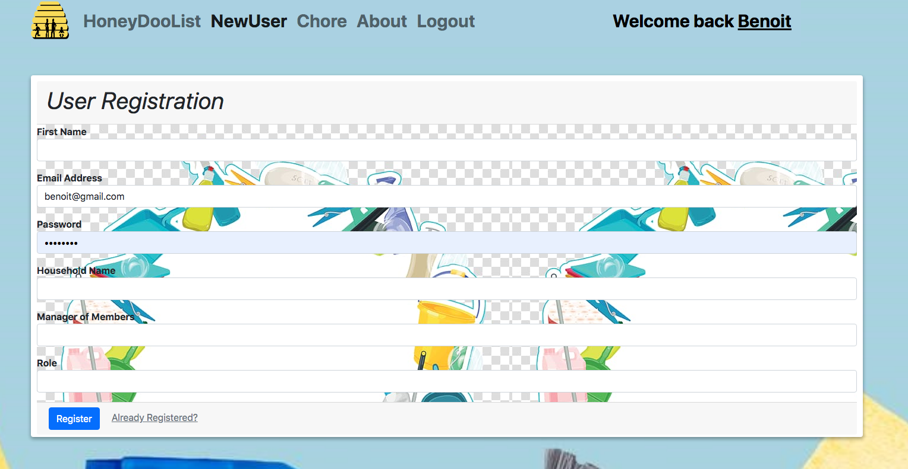
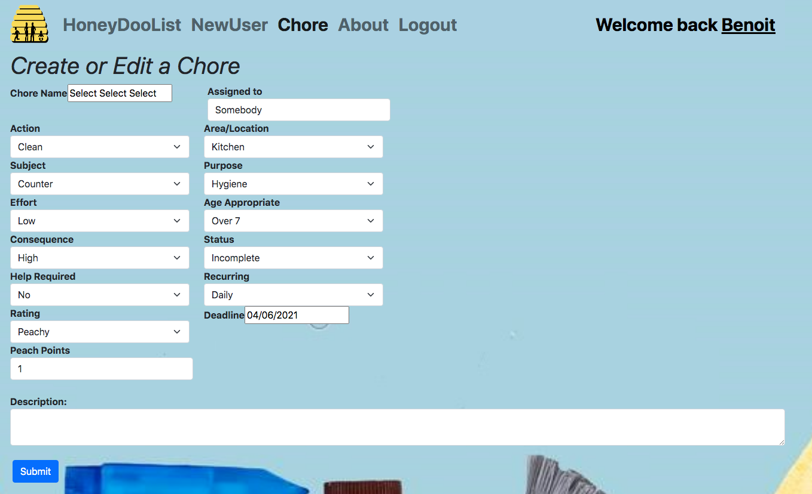

# HoneyDoo: The family to-do list.

At HoneyDoo, we care about getting things done. You should too, especially getting household chores done.  HoneyDoo has created an awesome way to help assign chores around the house and allow families to get on with getting things done. We do this by automating the assignment and tracking of chores in our HoneyDoo List that can easily be shared with household members.   

It’s simple, decide who is the manager of members (MOM) in your household and the MOM will set up the family in our multi-tenant database. Your data is secure and no other households will have access to your household chore data, unless the MOM grants them secure access through our chore portal.  

## Foreword

This is a project for the UoT Webstack develloper bootcamp that required the collaboration of four students on a a single project. We were provided with starter code in order to meet our deadline.

## Features
* Multi-household Processor enables scalability
* Chore-Name Generator enables standardization
* React-Date-Picker enable deadline enforcement

## Installation

This is assuming that you have node.js installed. If you do not, this link will help you with the installation; https://nodejs.org/en/download/package-manager/

Open a terminal;

npm install mongoose express react-bootstrap body-parser react-datepicker mdtables

Once this is installed, do the following;

npm run start:dev

### Dependencies

* Node.js: https://nodejs.org/en/
* MongoDB: https://www.mongodb.com/ 
* Body-parser: https://www.npmjs.com/package/body-parser 
* Express: https://www.npmjs.com/package/express                    
* React-datepicker: https://www.npmjs.com/package/react-datepicker
* Mdbtables: https://mdbootstrap.com/docs/react/tables/basic/

Do the following from a commandline;

1) git clone https://github.com/HoneyDooApp/HoneyDoo.git                
2) npm mongoose express axios React-date picker body-parser
4) npm run start:dev

## How do use HoneyDoo:

## Screenshots

### User Registration

### Create or Edit a Chore

### Viewing an individual's HoneyDoo list.

### TO-DO LIST (Future versions)

* Share or trade chores
* Send gentle reminders to eliminate nagging
* View and sort an individual’s HoneyDoo list
* Auto schedule recurring chores;
* Rate the chore execution
* Improve validation of entry fields.

                                   
## Licensing

GNU  

## Resources:

* Bootstrap (Components):  https://getbootstrap.com/
* React: https://reactjs.org/
* MongoDB: https://www.mongodb.com/
* Npm: https://www.npmjs.com/
